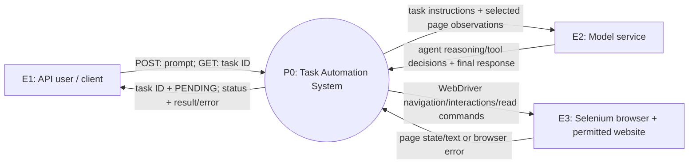
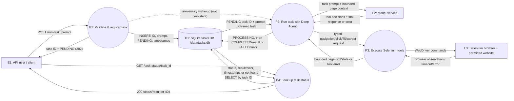
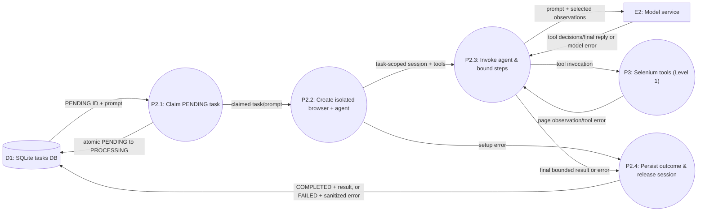

# Task Automation System — Data Flow Diagram (DFD)

এই নকশা [বাস্তবায়ন পরিকল্পনা](implementation-plan.md)-র **দুই-container MVP**-এর logical data flow দেখায়। সংশ্লিষ্ট কোড যোগ করা হয়েছে; live container/model integration এখনও যাচাই হয়নি। Mermaid-সমর্থিত Markdown viewer-এ চিত্রগুলো দেখা যাবে।

## চিহ্ন ও সীমানা

- **আয়তক্ষেত্র (E)**: সিস্টেমের বাইরের সত্তা; **বৃত্ত (P)**: data process; **সিলিন্ডার (D)**: স্থায়ী data store; তীরের লেখা: আদান-প্রদান হওয়া তথ্য।
- সিস্টেম সীমার ভেতরে FastAPI app, in-process worker, Deep Agent, Selenium tool adapter ও mounted `/data/tasks.db`। আলাদা Selenium container এবং অনুমোদিত website-কে একত্রে **E3 Browser environment** দেখানো হয়েছে; website-এর সঙ্গে HTTP আদান-প্রদান browser-এর মাধ্যমে হয়। E2 হলো configured OpenAI-compatible model service।
- In-memory queue **স্থায়ী data store নয়**; DB-তে `PENDING` task authoritative, queue কেবল worker-কে কাজের সংকেত দেয়।

## Level 0 — Context diagram



**সীমানার ব্যাখ্যা:** E1 অনুমোদিত API client; E2-তে credentials server-side runtime config থেকে যায় (চিত্রে দেখানো হয়নি); E3-তে শুধু অনুমোদিত site/domain-এ ব্রাউজিং করা যাবে। Browser container DB-তে সরাসরি লিখতে পারবে না।

## Level 1 — প্রধান data flow



**P1 ব্যর্থ হলে:** DB-তে INSERT না হলে ID ফেরত নয়; সীমা ছাড়ানো/অবৈধ input হলে validation error; queue-full নীতি পরিকল্পনা অনুযায়ী 429/503 এবং DB/dispatch সামঞ্জস্য রাখতে হবে। **P4 কোনো task চালায় না।** Startup recovery-তে worker D1 থেকে `PENDING` পুনরায় নেয় এবং stranded `PROCESSING`-কে `FAILED` করে।

## Level 2 — P2 Run task with Deep Agent-এর বিস্তার



P2.2-তে task-প্রতি **Remote WebDriver session** তৈরি হয়; P2.4-এর `finally` অংশে success/failure নির্বিশেষে `driver.quit()`। P2.3-তে tool-call ও সময়সীমা বলবৎ; P3 URL/redirect ও private-network policy যাচাই করবে। ফলাফলে গোপন মান বা পূর্ণ internal trace থাকবে না। Process crash হলে in-memory queue/task state নষ্ট হলেও DB থেকে pending শনাক্ত হয়; মাঝপথে থেমে যাওয়া `PROCESSING` স্বয়ংক্রিয়ভাবে আবার form submit করবে না।

## Data dictionary এবং status lifecycle

| নাম | বহন করা তথ্য | উৎস → গন্তব্য |
| --- | --- | --- |
| Task request | সীমিত দৈর্ঘ্যের prompt | E1 → P1 → D1 |
| Task acknowledgement | UUID task ID, PENDING | P1 → E1 |
| Model interaction | prompt, প্রয়োজনমতো সীমিত page observation; tool decision/final answer | P2/P2.3 ↔ E2 |
| Browser interaction | অনুমোদিত URL, selector, interaction; bounded page text/error | P3 ↔ E3 |
| Persisted task | `task_id`, `status`, `prompt`, `result_json` বা sanitized `error`, UTC timestamps | P1/P2 ↔ D1 |
| Status response | ID, PENDING/PROCESSING/COMPLETED/FAILED, result/error, timestamps | D1 → P4 → E1 |

```text
POST accepted          Worker atomic claim       Success
PENDING ───────────────────> PROCESSING ───────────> COMPLETED
                                  │                     (stored result)
                                  └── failure/timeout/restart ──> FAILED
                                      (stored sanitized error)
```

**ডিজাইন সীমা:** SQLite DB app-এর persisted volume-এ থাকবে; prompt retention ও API authentication/ownership production-এ প্রয়োজন। এই চিত্র logical data movement দেখায়—container networking, healthcheck, backup বা monitoring-এর পূর্ণ deployment diagram নয়।
